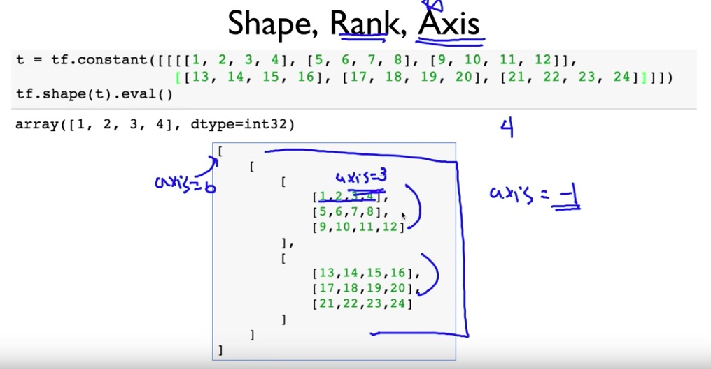
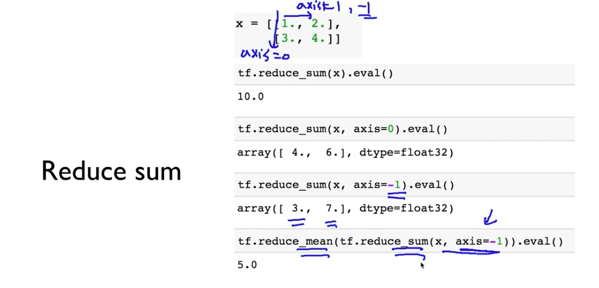
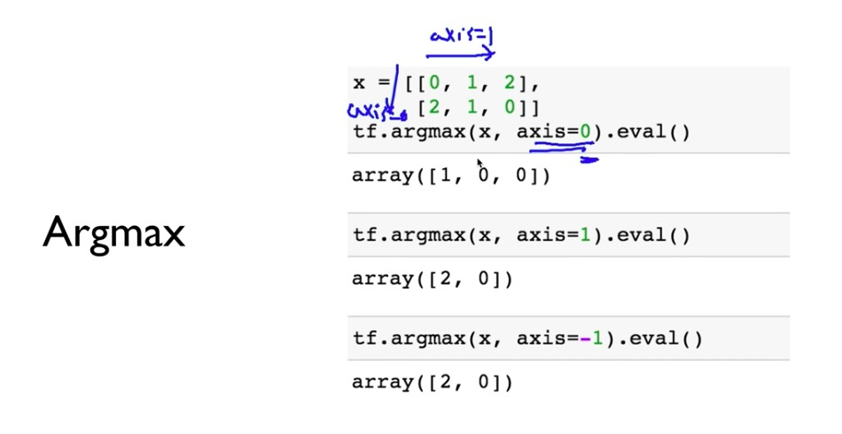
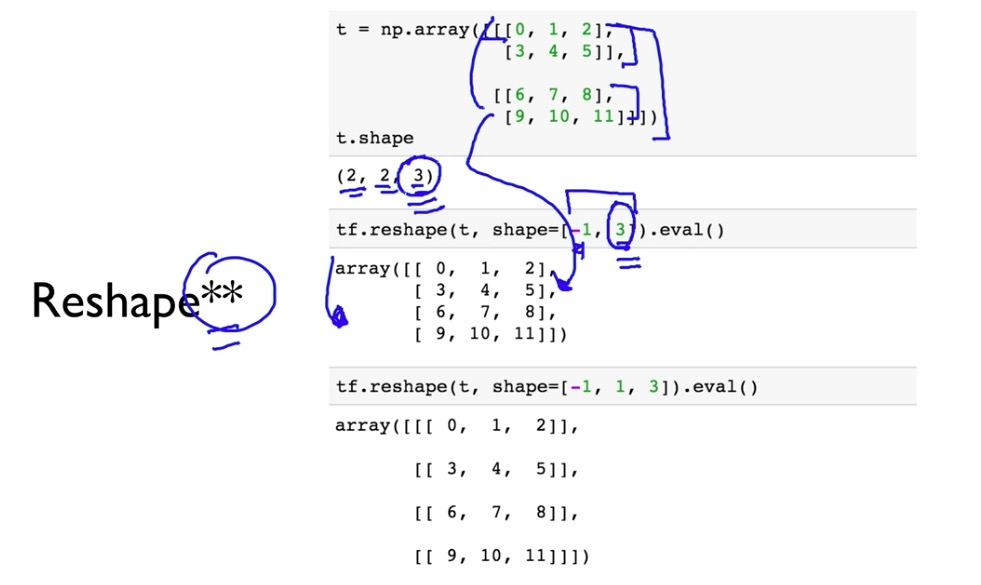
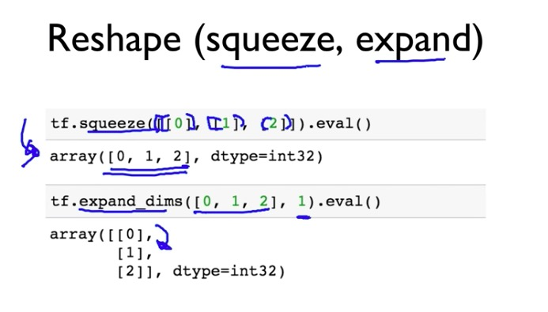
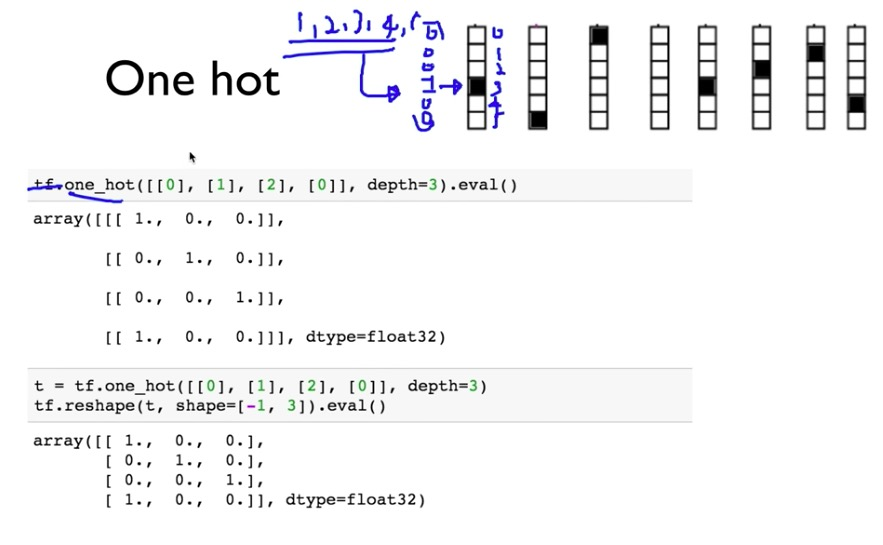
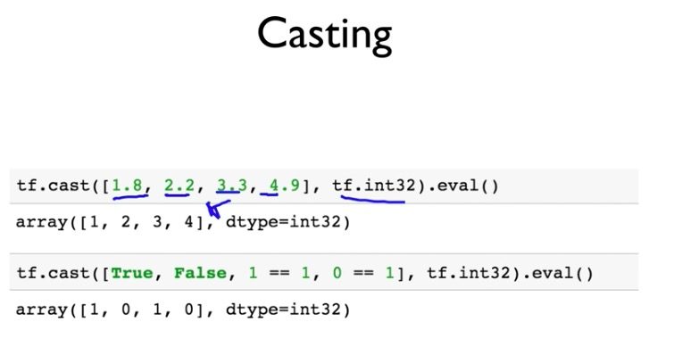
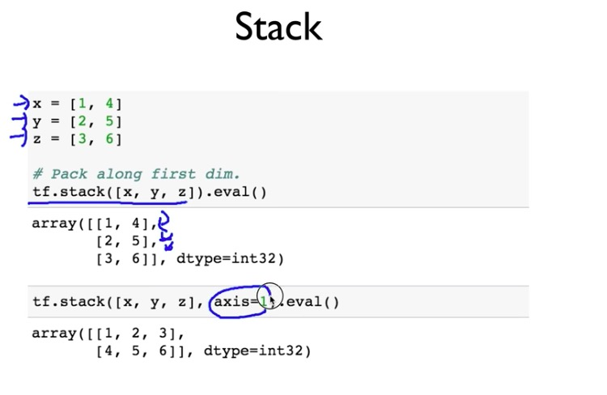
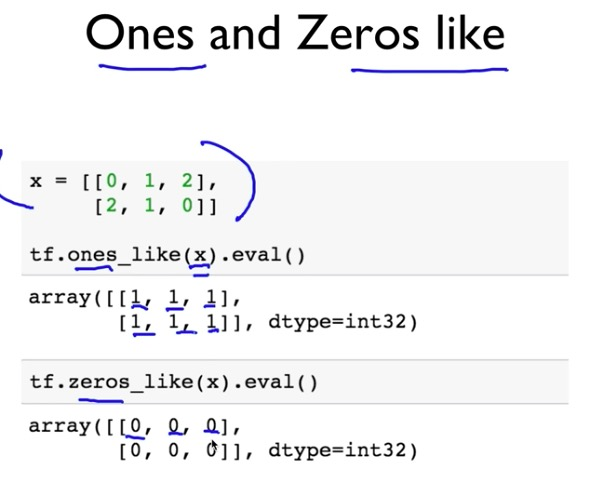
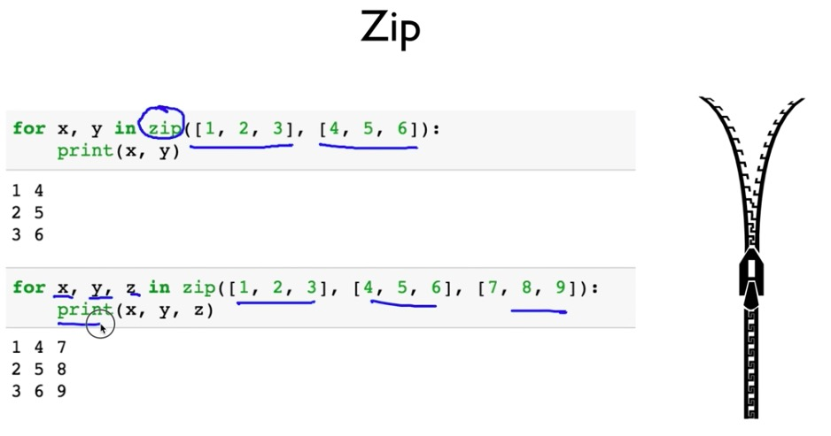

# manipulation

rank : [] 개수

shape : rank 개수만큼 숫자 있다. 가장 안쪽부터 오른쪽에 개수 센다 ( , , , ) -> (1, 2, 3, 4)

axis : 가장 안쪽에 있는 것이 가장 큰 값. 따라서 axis=3 또는 axis=-1(왜냐하면 rank가 4이니까 0 ~ 3). 가장 바깥쪽에 있는 것은 axis=0

* reduece sum

* argmax

* reshape

* squeeze & expand

* one hot

* casting

* stack

* ones and zeros like

* zip

