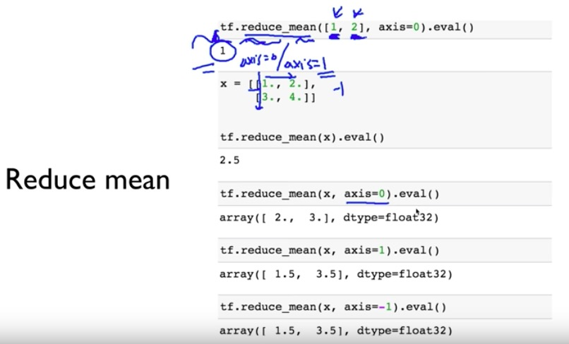

# manipulation


아래 실습 실행 전, session 활성화

```python
sess = tf.InteractiveSession()
```


rank : [] 개수


shape : rank 개수만큼 숫자 있다. 가장 안쪽부터 오른쪽에 개수 센다 ( , , , ) -> (1, 2, 3, 4)


axis : 가장 안쪽에 있는 것이 가장 큰 값. 따라서 axis=3 또는 axis=-1(왜냐하면 rank가 4이니까 0 ~ 3). 가장 바깥쪽에 있는 것은 axis=0

* reduce mean





평균 같은 경우 array 원소를 float형태로 적어야 한다(ex, 2.). 그렇지 않으면 정수 형태로 반환이 되어 제대로 된 평균값 구하기 어렵다


* reduece sum


* argmax


* reshape


* squeeze & expand


* one hot


* casting


* stack


* ones and zeros like


* zip


