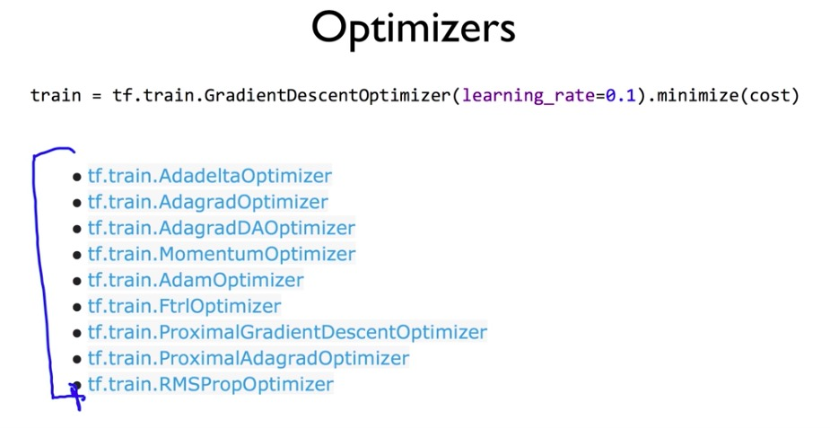

# tensorflow

> 머신러닝 오픈소스 라이브러리


* Ranks


* Shapes


* Types


## 여러개의 데이터 파일 이용할 때


## 함수

 ```python
# 계산해라
sess.run()

# 값을 넣어줄 것
tf.placeholder(tf.float32, shape=[None, 3])

# 값을 넣을 때, 반드시 집합 형태
feed_dict={X: x_data, y: y_data}

# matrix 곱 계산
tf.matmul(X, W)


 ```


## and others

tf.variable : tensorflow가 사용하는 variable, 즉 trainable한 variable, train 된 이후 계속 변경 되는 값

X, Y를 tf.placeholder로 지정할 때, shpae이 중요

만약 x_data = [[1,2], [2,3], [3,4]] 라면 shape=[None, 2]. 여기서 None은 몇 개의 데이터가 들어올지 모르기 때문이고, 하나의 x_data는 두 개의 값을 갖기 때문에 2. y_data = [[1],[2],[3]] 이라면 shape=[None, 1]


W,b를 tf.variable로 지정할 때 역시 shape이 중요

W = tf.Variable(tf.random_normal([2, 1]), name='weight')에서 2는 x_data 하나의 크기인 2, 1은 y_data 하나의 크기은 1

b = tf.Variable(tf.random_normal([1]), name='bias')에서 1은 나가는 값.


정리하면 x_data의 shape[None, 2]은 W = tf.Variable(tf.random_normal([2, 1]))에서 2 지정 y_data의 shape[None, 1]은 W = tf.Variable(tf.random_normal([2, 1]))에서 1지정. 그리고 b = tf.Variable(tf.random_normal([1]))에서 1지정


- 데이터 reshape 할 때, one_hot 적용하면서 햇었음. lab06-2 참조





일반적으로 adamOptimizer 많이 쓴다


[manipulation](./manipulation)

